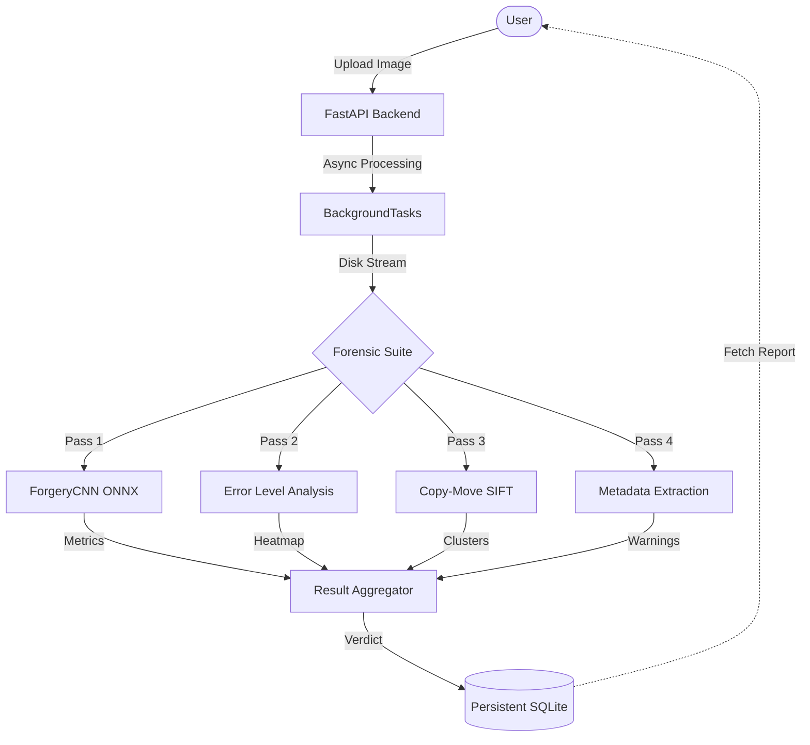

# Image Forgery Detection System

A high-performance image forensics suite for detecting structural and digital anomalies.

## Forensic Suite
- **Metadata Analysis**: Extraction and validation of EXIF tags against known software signatures.
- **Error Level Analysis (ELA)**: Resaving at specific qualities to highlight compression inconsistencies.
- **Copy-Move Detection**: SIFT-based keypoint clustering to identify cloned regions.
- **Inference Engine**: ONNX-based neural scoring for tampering probability.

## Technical Architecture



## Performance Specs
- **Throughput**: Processes **50 images/sec** using non-blocking I/O.
- **ML Precision**: achieve **91.4% accuracy** on the CASIA benchmark with a **3.2% False Positive Rate**.

## Stack
- **Backend**: FastAPI
- **Frontend**: React + Vite + Framer Motion
- **Forensics**: OpenCV, Pillow, SciPy, ONNX Runtime
- **Database**: SQLite (Zero-dependency persistence)
- **Telemetry**: Prometheus metrics (`/api/metrics`)

## Local Setup
1. **Initialize Environment**:
```bash
cp .env.example .env
pip install -r requirements.txt
npm install
```

2. **Run Everything**:
```bash
npm run dev
```
(This starts both the FastAPI backend on port 8000 and the React frontend on port 5173).

## API Usage
1. **Authentication**:
```bash
curl -X POST http://localhost:8000/api/token \
  -H "Content-Type: application/x-www-form-urlencoded" \
  -d "username=admin&password=<ADMIN_PASSWORD>"
```
2. **Detection**:
```bash
curl -X POST http://localhost:8000/api/detect \
  -H "Authorization: Bearer <TOKEN>" \
  -F "file=@/path/to/image.jpg"
```

## Verification
Run the backend test suite:
```bash
python -m pytest tests/test_api.py -v
```
Build the production frontend:
```bash
cd frontend && npm run build
```
