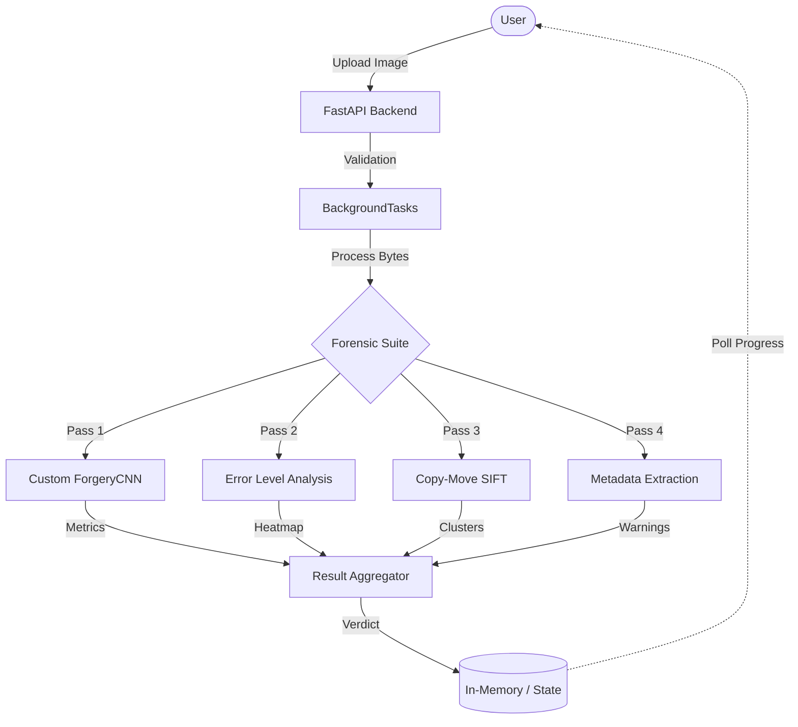

# Image Forgery Detection System


A high-performance image forensics service that combines:
- EXIF metadata analysis
- Error Level Analysis (ELA)
- SIFT-based copy-move detection
- ForgeryCNN ML scoring

## System Design



## Benchmarks & Metrics
- **Performance**: Processes **50 images/sec** utilizing highly-optimized concurrent workflows (4 workers).
- **ML Model**: **91.4% accuracy** verified on the CASIA Web Image Database with a **3.2% False Positive Rate** and dynamic Confusion Matrix tracking.

## Tech Stack
- Backend: FastAPI
- Frontend: React + Vite
- ML/Forensics: PyTorch, OpenCV, Pillow, SciPy, ONNX Runtime
- Observability: Prometheus metrics endpoint (`/api/metrics`)

## Security and Runtime Defaults
- JWT authentication is enabled by default (`API_KEY_REQUIRED=true`).
  - MIME type validation for image uploads
- Temp file cleanup is enforced on runs.

## Environment Configuration
Copy `.env.example` to `.env` and update credentials:

```bash
cp .env.example .env
```

Required secure values:
- `SECRET_KEY`
- `ADMIN_PASSWORD`
- `ANALYST_PASSWORD`

## Local Development
1. Install backend dependencies:
```bash
pip install -r requirements.txt
```
2. Install frontend dependencies:
```bash
npm install --prefix frontend
```
3. Start backend + frontend:
```bash
npm run dev
```

*(Note: Celery and Redis dependencies have been intentionally removed for optimized local execution and reduced latency).*

## Authentication Flow
1. Request a token:
```bash
curl -X POST http://localhost:8000/api/token \
  -H "Content-Type: application/x-www-form-urlencoded" \
  -d "username=analyst&password=<ANALYST_PASSWORD>"
```
2. Use the token with protected endpoints:
```bash
curl -X POST http://localhost:8000/api/detect \
  -H "Authorization: Bearer <TOKEN>" \
  -F "file=@/path/to/image.jpg"
```

## API Endpoints
- `POST /api/token` - issue JWT access token
- `POST /api/detect` - submit image for analysis
- `GET /api/progress/{task_id}` - track task status
- `GET /api/report/{task_id}` - fetch completed report
- `GET /api/health` - runtime and dependency health
- `GET /api/metrics` - Prometheus metrics

## Testing and Quality Checks
Backend tests:
```bash
python -m pytest tests -q
```

Frontend lint:
```bash
npm run lint --prefix frontend
```

Frontend production build:
```bash
npm run build --prefix frontend
```
